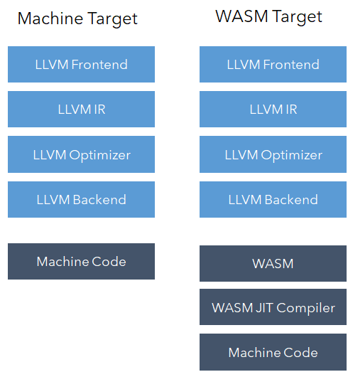

经过Mozilla、Google、Apple、Microsoft等技术巨头近10年的孵化和合作开发，2019年12月5号 Webassembly （WASM）Core Specification正式被W3C接纳web标准，成为浏览器中运行的HTML，CSS，Javascript之外的第四个语言，已经被四大主流浏览器（Firefox, Chrome, Safari, Edge）支持，各个层面大量的WASM开源项目开始涌现，包括语言编译器层面，几乎主流的编程语言都有WASM编译器项目，包括应用的WASM改造，包括非浏览器的WASM应用等，同时WASM社区也在非常快速扩展WASM的周边接口、安全规格等，有了WASM加持，Web浏览器重新焕发了青春，成为一个非常有竞争力的未来计算平台，Internet和web进入了进入一个新的时代。

WASM项目要解决的一个根本问题是web和原生应用平台竞争中处于劣势的Javascript语言的性能问题，Javascript 1995年被Netscape浏览器采纳是一个比较匆忙的决定（Brendan Eich 花了10天时间开发了第一个版本的javascript语言和解释器，[https://thenewstack.io/brendan-eich-on-creating-javascript-in-10-days-and-what-hed-do-differently-today/](https://thenewstack.io/brendan-eich-on-creating-javascript-in-10-days-and-what-hed-do-differently-today/)），经过了四大浏览器巨头多年在JS语言规格和JIT编译器上的投入，JS在性能和可用性方面有巨大的进步，JS语言已经成为最受欢迎的编程语言之一， 但是也无法避免其根本性的缺陷，例如：脚本解释性语言，动态类型，内存GC机制，和底层OS的交互等，这些缺陷导致移动互联网兴起的时候，基于HTML5开发的web移动应用惨败给原生的iOS和Android应用，WASM的前身ASM.js和Google的NaCl正是在那个背景下启动的。经过10年的开发，在JS用于web浏览器25年后，WASM被正式投入使用，同时也赶上了新一波的应用机会，例如：AR/VR应用，AI应用， IoT、wearable等新场景。

## 1. Webassembly 是什么

WASM是一个为虚拟计算机（Conceptual Machine）设计的概念汇编语言（Conceptual Assembly Language），设计的核心需求是跨平台和OS的可移植性（portability）和尽可能减少编译到机器代码时的性能损失（performance）。

WASM作为一种贴近机器代码的底层编程语言规格，如果把WASM虚拟机视为一个CPU，那么WASM就是它的ISA，其实很容易让人想起另一个当红的开源项目RISC V，RISC V 的ISA也是UCB花费多年心血精心打造出来的。上面提到了WASM的一个主要设计目标是移植性，所以必然和具体的CPU实现是解耦的，它是一个简化过的计算机模型，缺少物理CPU实现时候要考虑的多核、内存页、cache等具体的工程实现。但是WASM的设计又是很低层的，和CPU的ISA有可类比性，可以尽量减少编译为机器代码时候的开销。

Webassembly的汇编代码设计是第一个经严格按照形式化语义（formal semantics）理念设计的编程语言，这样的设计很方便做形式化证明，已经有学术界开始做这方面的工作（[https://www.cs.rit.edu/~mtf/student-resources/20191_huang_mscourse.pdf](https://www.cs.rit.edu/~mtf/student-resources/20191_huang_mscourse.pdf)）。这样的严谨设计，保障了WASM将会在具有足够长的生命周期和生命力。

下图展示了WASM的编译流程，WASM是LLVM编译器的一个backend实现。

在浏览器环境，WASM byte code 被浏览器内置的高性能JIT编译器编译执行，例如在Chrome浏览器中，V8编译器加入了一个新的WASM编译器Liftoff，和对JS的JIT解释和热点区域JIT编译实现不同，WASM byte code会被liftoff完全编译为机器代码。WASM设计的时候也考虑到了x86和arm ISA，力求保持编译到汇编代码的overhead。目前性能落后native code在20%到100%之间（[https://www.usenix.org/system/files/atc19-jangda.pdf](https://www.usenix.org/system/files/atc19-jangda.pdf)），当然直接比较C语言和Webassembly是公平的，为了达到安全和可移植性，会有增量的代码存在。WASM的编译器技术还在发展，性能会持续提升。

## 2. Webassembly 为web注入了新的生命力
WASM把浏览器变成一台虚拟机，之前这个虚拟机的功能比较薄弱，只能跑Javascript，不支持其他语言，这样要支持一些性能攸关和OS相关的资源访问，就需要把这些能力植入到浏览器的本体代码里面，W3C过去为Browser标准化了很多这样的功能，例如：音频视频解码，图像渲染能力，OS外设访问等。通过支持WASM，大量的存量代码都可以被重新编译为WASM模块，可以动态加载到web应用中，通过Javascript调用，而不需要再通过浏览器来支持。这也是WASM设计的主要场景。AutoCAD公司之前尝试过把 3D 设计工具使用web技术来实现，都失败了，因为大量物理引擎计算都是C/C++写的，如果用Javascript重写性能是不达标的。通过把这些物理模拟计算的C/C++库编译为WASM，性能问题得到解决，AutoCAD终于提供了基于web技术的设计工具，功能和原生版本相差无几。另外一个例子是，第一视角射击游戏的鼻祖DOOM最近被移植到了WASM环境（[https://wasm.continuation-labs.com/d3demo/](https://wasm.continuation-labs.com/d3demo/)），当你访问这个网址，基于WASM的DOOM游戏会被加载，其可玩性和性能都是不错的。Bullet、ODE、PhysX这样的高性能物理引擎也在重新编译为WASM，可以预见的未来基于web的游戏和AR/VR应用开发环境会出现可以和Unity、Unreal这样的商业游戏引擎一较高下的web版本。

另一个值得关注是Python语言和其科学计算包对WASM的移植（[https://alpha.iodide.io/](https://alpha.iodide.io/)），python在ML/AI中被广泛使用，计算本身和前端的UI可以在浏览器中完全实现完美结合了web的连接性和原生的计算能力，会创造出全新的用户体验和场景。TensorFlow的移植也在进行中（[https://github.com/tensorflow/tfjs/tree/master/tfjs-backend-wasm](https://github.com/tensorflow/tfjs/tree/master/tfjs-backend-wasm）。

## 3. Webassembly 的non-web应用
WASM既然是一种语言规格，通过不同的编译器实现完全可以运行在非浏览器的环境，WASM也在推广non-web的应用场景，其中WASI（Webassembly System Interface）是下一个最为关键的标准，它定义了异构编程语言的Runtime和WASM模块集成，WASM在浏览器中和JS和Web API对接，WASM模块访问OS功能等场景下的接口规格，WASI是一个数据格式标准，不同语言、OS、Runtime可以遵照这个统一的数据格式实现相互之间调用时候的变量数据类型适配。通过WASI，WASM模块的可集成性得到了彻底解决。在non-web环境下已经有多个WASM runtime项目，为了进一步合力开发non-web场景下的WASM使用，Mozilla、Intel、Fastly、Redhat发起成立了Byte Code Allince（[https://hacks.mozilla.org/2019/11/announcing-the-bytecode-alliance/](https://hacks.mozilla.org/2019/11/announcing-the-bytecode-alliance/)），包含了WASMTIME、Lucet、WAMR三个Runtiem和Cranelift，WASI COMMON等开源项目。同时也展示了他们规划的nanoprocess理念，提供了WASM模块之间的动态调用链接和基于细粒度能力调用的沙箱机制，这种nanoprocess将会极大推进一步推进软件SOA理念的实现。

本篇只是WASM最宏观的介绍，WASM技术还在快速发展和演进中，后续还会具体介绍相关领域的进展。
